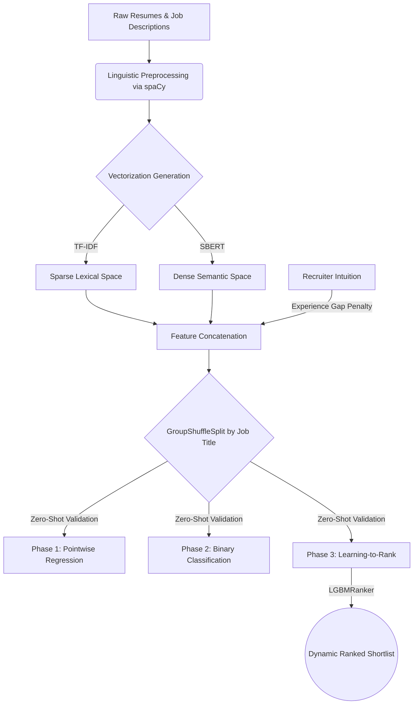

# Beyond the Keyword Match: A Human-Centric AI Approach to Resume Screening


Applicant Tracking Systems (ATS) historically rely on rigid, lexical keyword matching, frequently discarding highly qualified candidates who lack exact phrase alignments. This project resolves this structural inefficiency by engineering an automated, human-centric resume screening pipeline grounded in deep Natural Language Processing (NLP) and Learning-to-Rank (LTR) algorithms.

**Author:** Amber Agrawal
**Institution:** Symbiosis Statistical Institute (MSc Applied Statistics, 2025–2027)
**Affiliation:** IDEAS Foundation, ISI Kolkata
**Project Guide:** Dr. Dipasree Pal
**Internship Period:** 18th May 2026 – 31st July 2026

---

## 📊 Project Overview

Conventional recruitment infrastructures exhibit severe algorithmic vulnerabilities by relying almost exclusively on exact lexical overlap (TF-IDF / Boolean search). When a hiring manager searches for "Software Engineer" and a candidate lists "Backend Developer," legacy systems discard qualified talent due to vocabulary mismatch — not a genuine capability gap.

This project decouples candidate evaluation from rigid Boolean queries by prioritizing semantic relevance. It evaluates dense bi-encoder representations — specifically **Sentence-BERT-style embeddings** (`nomic-embed-text-v1.5`) — against baseline TF-IDF statistical term frequencies, across three distinct modelling paradigms: pointwise regression, binary classification, and listwise Learning-to-Rank. It further contributes a from-first-principles Bayesian treatment of the candidate "Experience Gap," comparing a linear baseline and a deployed piecewise-quadratic penalty against a novel Sigmoid-Bayesian posterior formulation.

### 🎯 Key Achievements

| Metric | TF-IDF Baseline | SBERT System | Improvement |
|--------|-----------------|--------------|-------------|
| ROC-AUC (Classification) | 0.6187 | **0.8121** | +31.3% |
| NDCG@10 (Ranking) | 0.9158 | **0.9398** | +2.6% |
| Split-Gain Feature Importance | 5.2% | **52.4%** | +908% |

*(Split-gain figures are the LGBMRanker feature-importance share for TF-IDF similarity vs. SBERT semantic similarity, respectively — see Chapter 5 / Appendix B of the thesis.)*

---

## 🧰 Technology Stack

Inferred directly from the notebook imports and `notebook/utils.py`.

### Core Data Processing
- **Data Wrangling:** pandas, NumPy
- **Linguistic NLP:** spaCy (`en_core_web_sm`) — tokenization, lemmatization, custom stop-words

### Vectorization & Embeddings
- **Statistical Vectors:** scikit-learn `TfidfVectorizer` / `CountVectorizer`
- **Neural Embeddings:** `sentence-transformers` with `nomic-embed-text-v1.5` (768-dimensional dense vectors)

### Machine Learning & Ranking
- **Regression Baselines:** `LinearRegression`, `Ridge`, `RandomForestRegressor`, `HistGradientBoostingRegressor`, `StackingRegressor`
- **Classification Baselines:** `LogisticRegression`, `RandomForestClassifier`, `SVC`
- **Learning-to-Rank:** LightGBM (`LGBMRanker`), XGBoost (`XGBRanker`) with LambdaMART / pairwise objectives
- **Evaluation:** `scikit-learn` metrics (`ndcg_score`, ROC-AUC, F1, RMSE, R²), `scipy.stats.spearmanr`

### Infrastructure
- **Development environment:** Google Colab (notebooks mount Google Drive and read Colab secrets via `google.colab.userdata`) — a couple of small edits are needed to run them as plain local Jupyter notebooks instead (see [Getting Started](#-getting-started--reproducibility))
- **Dataset acquisition:** `kaggle` API
- **Serialization:** `joblib`

> **Note:** there is currently no `requirements.txt` or `LICENSE` file in this repository. If you'd like others to reproduce this environment easily, consider adding a pinned `requirements.txt` (a starting list is in [Getting Started](#-getting-started--reproducibility) below) and a `LICENSE` file for the code itself, separate from the dataset's CC BY-NC 4.0 terms.

---

## ⚙️ Architecture & Pipeline Flow

The pipeline runs across modular phases to preserve structural integrity and prevent training-serving skew:



A more detailed, annotated version of this flowchart (including exact record counts at each stage) is in **Appendix A** of the thesis.

---

## 📂 Repository Structure

This reflects the actual current contents of the repository.

```
cv-screening/
├── README.md
│
├── data/                                   # Engineered features & artefacts
│   ├── ml_ready_dataset.csv                # Cleaned tabular dataset (9,369 records)
│   ├── cv_dense.npy                        # SBERT dense vectors (resumes)
│   ├── jd_dense.npy                        # SBERT dense vectors (job descriptions)
│   ├── cv_tfidf.npz                        # Sparse TF-IDF matrix (resumes)
│   ├── jd_tfidf.npz                        # Sparse TF-IDF matrix (job descriptions)
│   ├── tfidf_vectorizer.pkl                # Fitted TF-IDF vectorizer
│   └── objective_fit_neutral_value.pkl     # Contextual objective-fit artefact
│
├── notebook/                               # Core experimental notebooks (run in this order)
│   ├── 01_data_preprocessing.ipynb         # Ingestion, cleaning, EDA, feature engineering
│   ├── 03_phase1_regression.ipynb          # Pointwise regression (RMSE, R²)
│   ├── 04_phase2_classification.ipynb      # Binary classification (ROC-AUC, F1)
│   ├── 05_phase3_learning_to_rank.ipynb    # Listwise LTR (LGBMRanker vs. XGBRanker)
│   ├── 06_experience_gap_modeling.ipynb    # Linear / Quadratic / Sigmoid-Bayesian ΔE comparison
│   └── utils.py                            # Shared cleaning & feature-extraction utilities
│
├── thesis/                                 # Full academic report (LaTeX source + compiled PDF)
│   ├── main.tex
│   ├── main.pdf
│   ├── chapters/
│   │   ├── chapter1_introduction.tex
│   │   ├── chapter2_theoretical_foundations.tex
│   │   ├── chapter3_dataset_eda.tex
│   │   ├── chapter4_experimental_design.tex
│   │   ├── chapter5_results.tex
│   │   ├── chapter6_conclusion.tex
│   │   └── appendices.tex
│   └── images/                             # Figures referenced by the report
│
├── results/                                # Per-phase result write-ups (Word documents)
│   ├── regresion prob.docx
│   ├── clasification prob.docx
│   └── rank problem.docx
│
└── finnal internship presentation .mp4     # Recorded final presentation
```

> **Note on notebook numbering:** there is no `02_...ipynb` in the `notebook/` folder — numbering goes `01`, then `03`–`06`. This is the real, current file set; renumber if you'd prefer a gapless sequence.

---

## 🚀 Getting Started & Reproducibility

### Prerequisites

- Python 3.8 or higher
- pip or conda
- A Kaggle account + API token, to download the dataset
- ~2 GB free disk space (embeddings + data artefacts)

### Installation

1. **Clone the repository:**
   ```bash
   git clone https://github.com/Amber-s-art/cv-screening.git
   cd cv-screening
   ```

2. **Create a virtual environment:**
   ```bash
   python3 -m venv venv
   source venv/bin/activate  # On Windows: venv\Scripts\activate
   ```

3. **Install dependencies** — there's no pinned `requirements.txt` in the repo yet, but this covers everything imported across the notebooks:
   ```bash
   pip install pandas numpy scipy scikit-learn lightgbm xgboost \
               sentence-transformers spacy wordcloud seaborn matplotlib \
               torch tqdm joblib kaggle
   python -m spacy download en_core_web_sm
   ```

4. **Download the Kaggle dataset:**
   ```bash
   kaggle datasets download -d saugataroyarghya/resume-dataset
   unzip resume-dataset.zip -d data/
   ```

### A note on Google Colab

These notebooks were developed and run in **Google Colab** — `01_data_preprocessing.ipynb` and others mount Google Drive (`google.colab.drive`) and read secrets via `google.colab.userdata` (e.g., the Kaggle API key). To run them locally instead of in Colab:
- Replace any `drive.mount(...)` cell with your own local paths.
- Replace `userdata.get('KAGGLE_KEY')`-style calls with your local Kaggle credentials (`~/.kaggle/kaggle.json`).

Alternatively, just open the notebooks directly in Colab and run them there with no changes.

### Execution Order

1. **Data Preprocessing** — `notebook/01_data_preprocessing.ipynb`
   Produces `ml_ready_dataset.csv`, TF-IDF matrices, and SBERT embeddings.
2. **Phase 1 — Pointwise Regression** — `notebook/03_phase1_regression.ipynb`
   Continuous match-score prediction (RMSE, R²).
3. **Phase 2 — Binary Classification** — `notebook/04_phase2_classification.ipynb`
   Threshold-based accept/reject screening (ROC-AUC, F1).
4. **Phase 3 — Learning-to-Rank** — `notebook/05_phase3_learning_to_rank.ipynb`
   Listwise ranking optimization (NDCG@K, Spearman ρ).
5. **Experience-Gap Modeling** — `notebook/06_experience_gap_modeling.ipynb`
   Linear vs. Quadratic vs. Sigmoid-Bayesian ΔE penalty comparison.

---

## 📈 Key Findings & Conclusions

### 1. Semantic Understanding Outperforms Keyword Matching

Dense SBERT embeddings captured contextual relationships independent of exact terminology. On binary classification (threshold ≥ 0.60):
- **TF-IDF only:** ROC-AUC = 0.6187, F1 = 0.5568
- **SBERT only:** ROC-AUC = 0.8121, F1 = 0.7142
- **Improvement:** +31.3% AUC separation

### 2. Learning-to-Rank Is the Correct Mathematical Paradigm

Regression (absolute score prediction) and classification (a fixed accept/reject threshold) both fail to produce an ordered shortlist — which is what recruiters actually need. LTR solves the real problem directly.

Final performance (LGBMRanker + SBERT, zero-shot on 6 unseen job titles):
- **NDCG@10:** 0.9398
- **NDCG@5:** 0.9482
- **Spearman ρ:** 0.4367

### 3. Group-Aware Validation Prevents Data Leakage

Naive random splits would let models memorize job-specific vocabulary. `GroupShuffleSplit`, stratified by `Job_Title` (22 training titles / 6 completely unseen test titles), ensures test metrics measure genuine zero-shot generalization.

### 4. Feature Importance Breakdown (LGBMRanker split-gain)

| Component | Contribution |
|-----------|---------------|
| Semantic Similarity (SBERT) | 52.4% |
| Experience Penalty (ΔE) | 28.1% |
| Dynamic Role Flags | 8.5% |
| TF-IDF Similarity | 5.2% |
| Location Role Flag | 3.8% |
| Academic Flag | 2.0% |

### 5. The Experience Gap as a Bayesian Problem

Three competing formulations for penalizing/rewarding the candidate experience gap (ΔE) were derived and compared: a **Linear** baseline, a deployed **Piecewise Quadratic** penalty, and a proposed **Sigmoid-Bayesian posterior** that fuses the SBERT match score (as a prior) with a logistic likelihood over ΔE via Bayes' rule. The quadratic penalty saturates to a hard floor beyond ΔE ≈ −4.33 years (losing discriminative signal in that range); the Sigmoid-Bayesian formulation decays smoothly instead. Full derivation in Chapter 2, empirical comparison in Chapter 5 of the thesis.

---

## 🔮 Future Work & Recommendations

- **Full-scale Bayesian pipeline integration** — merge the Sigmoid-Bayesian adjusted score into the primary feature set and retrain LGBMRanker on the full corpus.
- **Transition to fully empirical Bayesian inference** — once longitudinal hiring-outcome data is available, replace the hand-specified sigmoid likelihood with one fit directly on observed hire/no-hire outcomes.
- **Counterfactual bias mitigation** — stratified resampling / synthetic token substitution (e.g., replacing prestigious company or university names with placeholder tokens during training) to reduce prestige-driven bias in the embeddings.
- **Generative explainability** — a lightweight LLM layer on top of the LGBMRanker shortlist to generate a short natural-language justification per ranked candidate (RAG-style).
- **Production deployment** — containerize the pipeline, expose it via an API, and add a simple dashboard for HR users to upload batches and view ranked shortlists.

---

## 📚 Academic References

**Core papers:**
- Reimers, N., & Gurevych, I. (2019). Sentence-BERT: Sentence embeddings using Siamese BERT-networks. *arXiv preprint arXiv:1908.10084*.
- Ke, G., Meng, Q., Finley, T., et al. (2017). LightGBM: A highly efficient gradient boosting decision tree. *Advances in Neural Information Processing Systems*, 30, 3146–3154.
- Pedregosa, F., Varoquaux, G., Gramfort, A., et al. (2011). Scikit-learn: Machine learning in Python. *Journal of Machine Learning Research*, 12, 2825–2830.
- Burges, C. J. C. (2010). From RankNet to LambdaRank to LambdaMART: An Overview. *Microsoft Research Technical Report*, MSR-TR-2010-82.

**Dataset:**
- Roy Arghya, S. (2024). Resume Dataset. Kaggle. https://www.kaggle.com/datasets/saugataroyarghya/resume-dataset (CC BY-NC 4.0)

**Embedding model:**
- Nomic AI (2024). Nomic Embed Text v1.5: Resilient Long-Context Text Embeddings. https://www.nomic.ai/

---

## 📄 License

No `LICENSE` file currently exists in this repository. The underlying **dataset** is distributed by its author under **CC BY-NC 4.0** (share and adapt, with attribution, non-commercially). If you want the *code* in this repo to carry an explicit license, add a `LICENSE` file — CC BY-NC 4.0 would keep it consistent with the dataset's terms, but a permissive license like MIT is also common for research code even when the training data itself is more restricted.

---

## 🤝 Acknowledgements

This project was developed during a summer internship at the **IDEAS Foundation, ISI Kolkata** (May–July 2026).

Thanks to:
- **Dr. Dipasree Pal** — Project guide and mentor
- **Symbiosis Statistical Institute** — Academic institution
- **IDEAS Foundation** — Research infrastructure and mentorship
- **Saugata Roy Arghya** — Kaggle dataset curation

### Contributing

Found a bug or have a suggestion? Open an issue or a pull request:
1. Fork the repository
2. Create a feature branch: `git checkout -b feature/improvement`
3. Commit your changes: `git commit -m "Add improvement"`
4. Push the branch and open a Pull Request

---

## 📧 Contact

**Author:** Amber Agrawal
**GitHub:** [@Amber-s-art](https://github.com/Amber-s-art)

*(The previous README listed a contact email with a typo in both the display text and the link target — update this section with your correct address if you'd like it here.)*

---

## 📑 Citing This Work

```bibtex
@misc{agrawal2026cv_screening,
  author       = {Agrawal, Amber},
  title        = {Beyond the Keyword Match: A Human-Centric Approach to Resume Screening and Candidate Ranking},
  year         = {2026},
  howpublished = {Summer Internship Project Report, IDEAS Foundation, ISI Kolkata},
  note         = {\url{https://github.com/Amber-s-art/cv-screening}}
}
```

---

**Last updated:** August 2026
